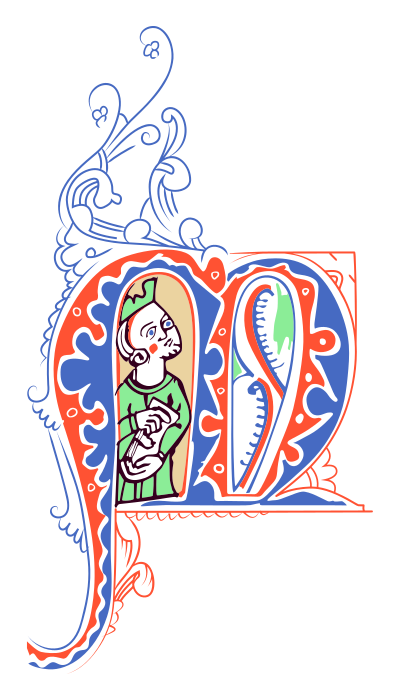
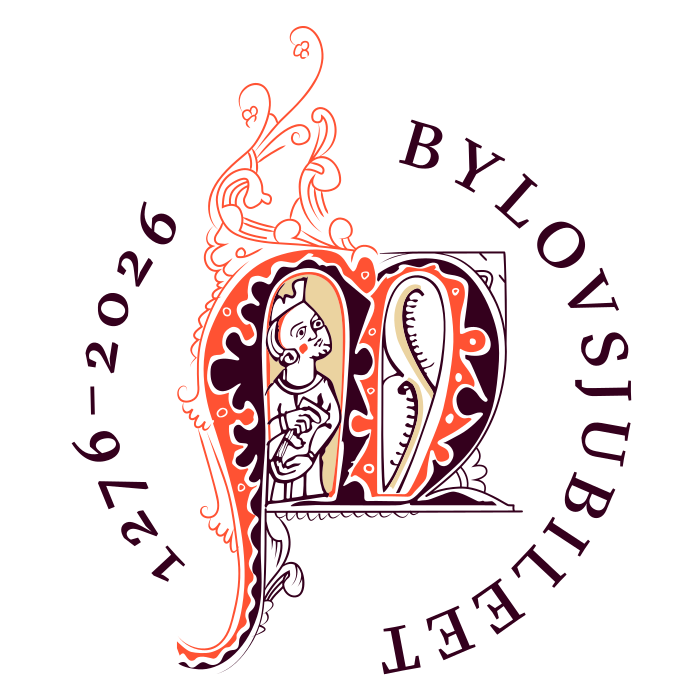
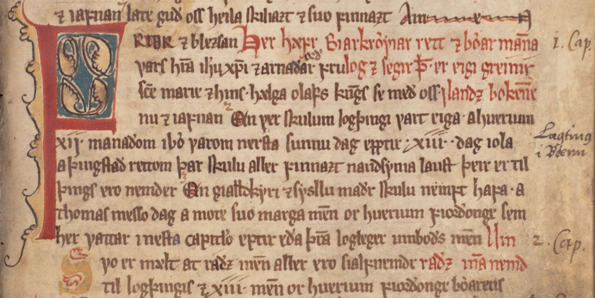
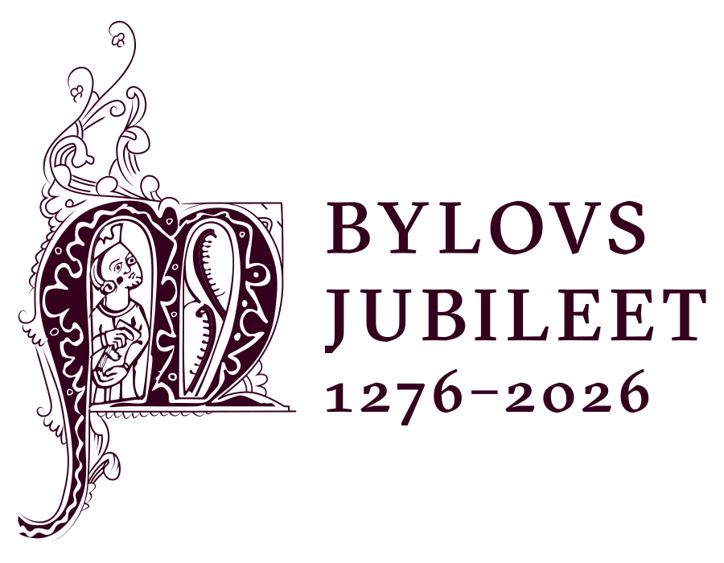

# _... ok sęgir þat er eigi greinir í Landsbókenne_

## Digital utstilling i anledning av Bylovsjubileet 2026

Robert K. Paulsen | UiB:UB

---
<!--
paginate: true
header: '_... og sęgir þat er eigi greinir í Landsbókenne_'
footer: 'Robert K. Paulsen | **UiB:UB**'
-->

## Bakgrunn
- Inspirert av Landslovjubileet
- Initiativ fra Alexandros Tsakos
- Samarbeid
  - Universitetsbiblioteket
  - LLE
  - AHKR
  - Juss
  - Universitetsmuseum

---

Begynnelsen av Bylova i Holm perg 34 4to (75r, ca. 1300)

---

## Struktur
- Landslovens struktur i bolker gir lite mening
- Heller en tematisk orden

---

---

Takk for oppmerksomheten!

Besøk **bylovsjubileet.uib.no**
